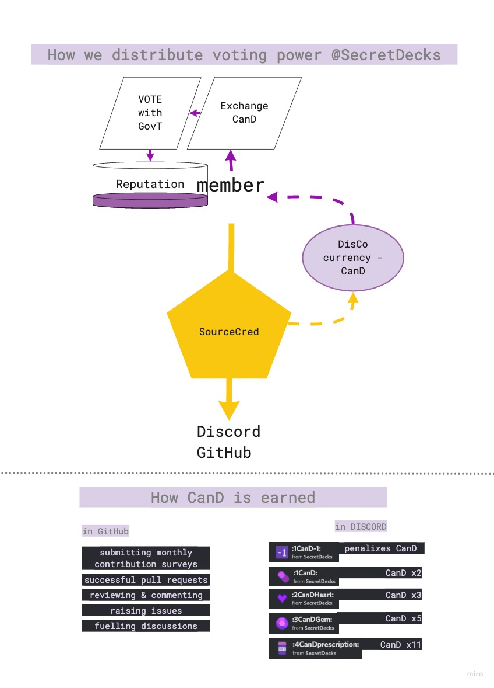

# How we (want to) vote

#### Status Quo

Currently voting and polling is done with Discord Bots (Pollmaster Plus and Sesh). Each voting or poll process is documented and tracked in a GitHub issue (ticket). Voting more extensive (proposal) polls only after closed.

Upon vote/poll end the result and potential action items are documented in the issue.  [An example of a closed poll ](https://github.com/SecretDecks/Documentation/issues/90)and a [concluded voting](https://github.com/SecretDecks/Documentation/issues/130).

#### Difference between vote & poll

A vote entails a binding decision and is usually only done by <mark style="color:purple;">Core</mark> members.&#x20;

A poll can be cast by <mark style="color:green;">Initiates</mark> or <mark style="color:purple;">Core</mark> members alike and only entails  guiding decisions.

#### The Goal

Each member is attributed (voting) power on a merit basis. A basic polling system is in place and will soon be extended with a blockchain recorded voting process. Distributed decision making tools and processes will be piloted and iterated until comprehensive parts can be published under OpenSource licenses.

#### How Decisions should flow

.png>)
